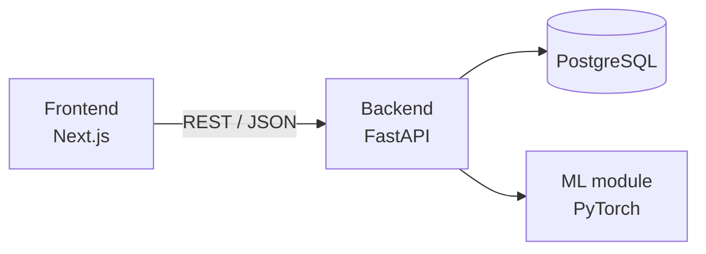
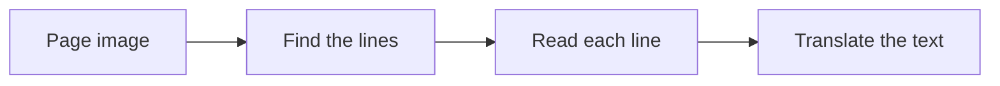

# System architecture

The frontend only talks to the backend. The backend stores data in PostgreSQL and calls the ML module for recognition.

## Recognition pipeline (proposal)

Details and model candidates for each step are in [AI model research](ai-model-research.md).
