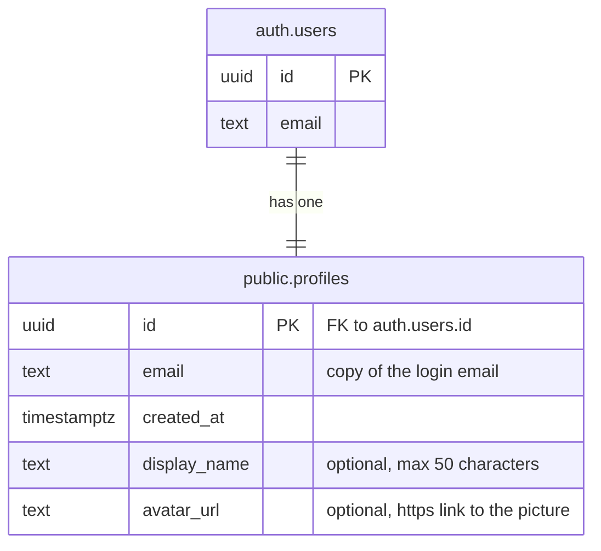

# Database

The database runs on [Supabase](https://supabase.com) (managed PostgreSQL + Auth).
Supabase Auth handles sign up, log in and passwords in its own `auth` schema.
Our own tables live in the `public` schema.

The full SQL is in [Setup SQL](#setup-sql) at the bottom of this page, so the database can be rebuilt
on a new Supabase project at any time.

## Schema



### `public.profiles`

One row per registered user. Created automatically at sign up; the app never inserts rows itself.

| Column       | Type          | Notes |
| ------------ | ------------- | ----- |
| `id`         | `uuid`        | Primary key. Same id as `auth.users.id`. Deleted together with the user (`ON DELETE CASCADE`). |
| `email`      | `text`        | Copy of the login email, kept in sync by a trigger. Not null. |
| `created_at` | `timestamptz` | When the profile was created. Defaults to `now()`. |
| `display_name` | `text` | Name shown in the app. Optional (can be empty), max 50 characters. Set at sign up or edited later by the user. |
| `avatar_url` | `text` | Link to the profile picture (e.g. a `.webp` image). Optional, must start with `https://`. Only the link is stored, not the image. |

### Triggers

| Trigger | On | What it does |
| ------- | -- | ------------ |
| `on_auth_user_created` | insert into `auth.users` | Calls `handle_new_user()`, which creates the matching profile row. If a `display_name` was sent at sign up, it is saved too. |
| `on_auth_user_email_changed` | update of `auth.users.email` | Calls `handle_user_email_change()`, which copies the new email into the profile. |

Both functions are `SECURITY DEFINER` with an empty `search_path`, and nobody can call them
through the API. If a trigger fails, the sign up fails too, so a user can never exist without a profile.

### Security (Row Level Security)

RLS is enabled on `profiles`.

| Role | Can do |
| ---- | ------ |
| `anon` (not logged in) | nothing |
| `authenticated` (logged in) | `SELECT` their own row only (`auth.uid() = id`) and `UPDATE` only `display_name` and `avatar_url` of their own row |
| triggers | insert and update rows |

Users cannot change `id`, `email` or `created_at`, and cannot insert or delete profiles.
When we add another editable profile field, add it to `GRANT UPDATE (...) ... TO authenticated`.

### Using the profile in the app

Send the display name at sign up (it is saved in the profile by the trigger):

```ts
await supabase.auth.signUp({
  email,
  password,
  options: { data: { display_name: "Alice" } },
});
```

Edit the name and picture later (logged in users, own profile only):

```ts
await supabase.from("profiles").update({ display_name, avatar_url }).eq("id", user.id);
```

## Setting up a Supabase project

1. **Auth settings** (Dashboard → Authentication → Sign In / Providers):
   - **Email** provider: on.
2. **Run the SQL:** open *SQL Editor*, paste the [Setup SQL](#setup-sql) below and click *Run*.

## Updating an existing project

If the project was set up before `display_name` and `avatar_url` were added, run this once in the *SQL Editor*
instead of the full Setup SQL (new projects don't need it, the Setup SQL below already includes it):

```sql
-- Adds the display name and profile picture to the profiles table
ALTER TABLE public.profiles
    -- name shown in the app (optional, max 50 characters)
    ADD COLUMN display_name TEXT CHECK (char_length(display_name) <= 50),
    -- link to the profile picture, e.g. a .webp image (optional, must be an https link)
    ADD COLUMN avatar_url TEXT CHECK (avatar_url ~ '^https://');

-- Updates the sign up trigger so the display name given at sign up (user metadata) is saved in the profile
CREATE OR REPLACE FUNCTION public.handle_new_user()
RETURNS TRIGGER AS $$
BEGIN
    INSERT INTO public.profiles (id, email, display_name)
    VALUES (
        NEW.id,
        NEW.email,
        nullif(left(trim(NEW.raw_user_meta_data ->> 'display_name'), 50), '')
    );
    RETURN NEW;
END;
$$ LANGUAGE plpgsql SECURITY DEFINER SET search_path = '';

-- Logged in users can edit only these two columns (email and created_at stay protected)
GRANT UPDATE (display_name, avatar_url) ON TABLE public.profiles TO authenticated;

-- Allows users to edit only their own profile data
CREATE POLICY "Users can update own profile"
    ON public.profiles FOR UPDATE
    USING ((select auth.uid()) = id)
    WITH CHECK ((select auth.uid()) = id);
```

## Keys and environment variables

Each person creates their own `.env` files with the content below and fills in the values.
These files are git-ignored: never commit them, and never share the secret key in chat.

**Frontend:** create `frontend/.env.local`

```
# Supabase project URL (Dashboard -> Project Settings -> Data API)
NEXT_PUBLIC_SUPABASE_URL=https://your-project-ref.supabase.co
# Supabase publishable key (Dashboard -> Project Settings -> API Keys), safe in the browser because RLS protects the data
NEXT_PUBLIC_SUPABASE_PUBLISHABLE_KEY=your-publishable-key
```

**Backend:** create `backend/.env`

```
# Supabase project URL (Dashboard -> Project Settings -> Data API)
SUPABASE_URL=https://your-project-ref.supabase.co
# Supabase secret key (Dashboard -> Project Settings -> API Keys), bypasses RLS so it must only be used in the backend
SUPABASE_SECRET_KEY=your-secret-key
```

Write each line as `NAME=value` (no quotes or brackets) and restart the dev server after changing a `.env` file.
If you don't have access to the Supabase Dashboard, ask the database owner for the values.

## Setup SQL

Run once on a new Supabase project (SQL Editor → paste → *Run*).

```sql
-- Creates the profiles table, its triggers and security rules (run once on a new Supabase project)

-- Creates the user profiles table linked to Supabase Auth
CREATE TABLE public.profiles (
    -- sets unique id for row
    -- same id as the user in auth.users, the profile is deleted together with the user
    id UUID PRIMARY KEY REFERENCES auth.users(id)
    ON DELETE CASCADE,
    -- copy of the login email (kept in sync by the triggers below)
    email TEXT NOT NULL,
    -- records when the profile was created (NOT NULL prevents rows without a timestamp)
    created_at TIMESTAMPTZ DEFAULT now() NOT NULL,
    -- name shown in the app (optional, max 50 characters)
    display_name TEXT CHECK (char_length(display_name) <= 50),
    -- link to the profile picture, e.g. a .webp image (optional, must be an https link)
    avatar_url TEXT CHECK (avatar_url ~ '^https://')
);

-- Creates a trigger function to automatically populate public.profiles (the display name comes from the sign up metadata)
CREATE OR REPLACE FUNCTION public.handle_new_user()
RETURNS TRIGGER AS $$
BEGIN
    INSERT INTO public.profiles (id, email, display_name)
    VALUES (
        NEW.id,
        NEW.email,
        nullif(left(trim(NEW.raw_user_meta_data ->> 'display_name'), 50), '')
    );
    RETURN NEW;
END;
$$ LANGUAGE plpgsql SECURITY DEFINER SET search_path = '';

-- automated listener, executes handle_new_user()
CREATE OR REPLACE TRIGGER on_auth_user_created
    AFTER INSERT ON auth.users
    FOR EACH ROW
    EXECUTE FUNCTION public.handle_new_user();

-- Keeps public.profiles.email in sync when a user changes their login email
CREATE OR REPLACE FUNCTION public.handle_user_email_change()
RETURNS TRIGGER AS $$
BEGIN
    UPDATE public.profiles SET email = NEW.email WHERE id = NEW.id;
    RETURN NEW;
END;
$$ LANGUAGE plpgsql SECURITY DEFINER SET search_path = '';

-- automated listener, executes handle_user_email_change() only if the email actually changed
CREATE OR REPLACE TRIGGER on_auth_user_email_changed
    AFTER UPDATE OF email ON auth.users
    FOR EACH ROW
    WHEN (OLD.email IS DISTINCT FROM NEW.email)
    EXECUTE FUNCTION public.handle_user_email_change();

-- These functions are only meant to run as triggers, so nobody should be able to call them through the API. Triggers keep working without these privileges.
REVOKE EXECUTE ON FUNCTION public.handle_new_user() FROM PUBLIC, anon, authenticated;
REVOKE EXECUTE ON FUNCTION public.handle_user_email_change() FROM PUBLIC, anon, authenticated;

-- Removes the full access Supabase gives to every new table, logged in users can only read and edit their name and picture (rows are created by the triggers)
REVOKE ALL ON TABLE public.profiles FROM anon, authenticated;
GRANT SELECT ON TABLE public.profiles TO authenticated;
GRANT UPDATE (display_name, avatar_url) ON TABLE public.profiles TO authenticated;

-- Enables Row Level Security (RLS) to protect user data
ALTER TABLE public.profiles ENABLE ROW LEVEL SECURITY;

-- Allows users to read only their own profile data
CREATE POLICY "Users can view own profile"
    ON public.profiles FOR SELECT
    USING ((select auth.uid()) = id);

-- Allows users to edit only their own profile data
CREATE POLICY "Users can update own profile"
    ON public.profiles FOR UPDATE
    USING ((select auth.uid()) = id)
    WITH CHECK ((select auth.uid()) = id);
```
