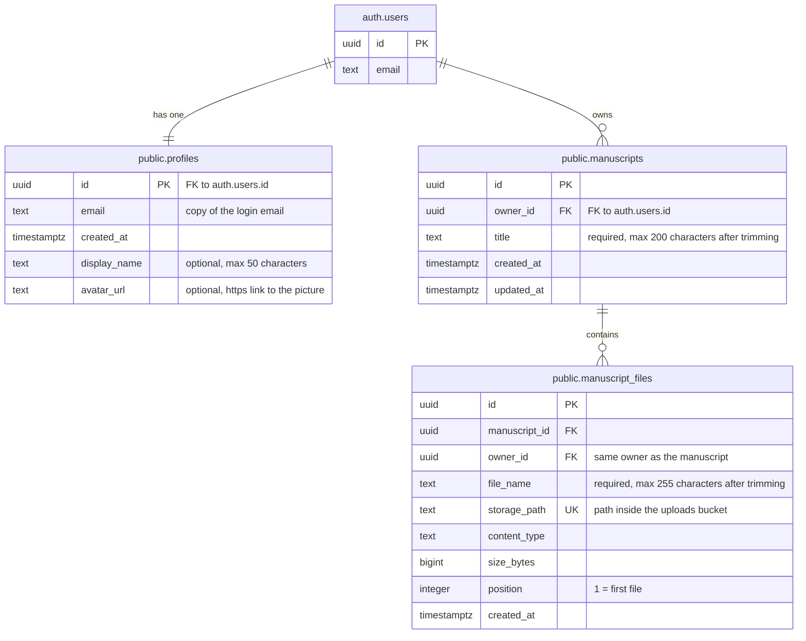

# Database

The database runs on [Supabase](https://supabase.com) (managed PostgreSQL + Auth).
Supabase Auth handles sign up, log in and passwords in its own `auth` schema.
Our own tables live in the `public` schema.

The SQL for our three tables is in [Setup SQL](#setup-sql) at the bottom of this page.
Run it in order on a new Supabase project, then configure Auth and Storage as described below.
The SQL recreates the tables and their rules; it does not restore existing users, rows or uploaded files.

## Schema



### `public.profiles`

One row per registered user. Created automatically at sign up; the app never inserts rows itself.

| Column       | Type          | Notes |
| ------------ | ------------- | ----- |
| `id`         | `uuid`        | Primary key. Same id as `auth.users.id`. Deleted together with the user (`ON DELETE CASCADE`). |
| `email`      | `text`        | Copy of the login email, kept in sync by a trigger. Not null. |
| `created_at` | `timestamptz` | When the profile was created. Defaults to `now()`. |
| `display_name` | `text` | Name shown in the app. Optional (can be empty), max 50 characters. Set at sign up or edited later by the user. |
| `avatar_url` | `text` | Link to the profile picture (e.g. a `.webp` image). Optional, must start with `https://`. Only the link is stored, not the image. |

### `public.manuscripts`

One row per manuscript in a user's library. A manuscript groups uploaded files, like a folder.
A user can create several manuscripts, and each manuscript can contain several files.

| Column | Type | Notes |
| ------ | ---- | ----- |
| `id` | `uuid` | Primary key. Generated automatically. |
| `owner_id` | `uuid` | Defaults to the logged in user's `auth.uid()`. References `auth.users.id`; deleting the user deletes their manuscripts. |
| `title` | `text` | Name shown in the library. Required; must contain 1 to 200 characters after trimming. |
| `created_at` | `timestamptz` | When the manuscript row was created. Defaults to `now()`. |
| `updated_at` | `timestamptz` | Defaults to `now()`. A trigger updates it whenever the manuscript row changes. Changing its file rows alone does not update this timestamp. |

The pair `(id, owner_id)` is unique so the files table can check both the manuscript and its owner.
Indexes support listing a user's manuscripts newest first and searching within titles (`pg_trgm`).

### `public.manuscript_files`

One row per uploaded file belonging to a manuscript. This table stores the file's details and location;
the file itself belongs in the `uploads` Storage bucket.

| Column | Type | Notes |
| ------ | ---- | ----- |
| `id` | `uuid` | Primary key. Generated automatically. |
| `manuscript_id` | `uuid` | The manuscript this file belongs to. Required. |
| `owner_id` | `uuid` | Defaults to `auth.uid()`. Must match the manuscript's owner through the composite foreign key. |
| `file_name` | `text` | Original uploaded name. Required; must contain 1 to 255 characters after trimming. Can be renamed later. |
| `storage_path` | `text` | Unique object path inside `uploads`, not a full URL. For example, `<owner_id>/<manuscript_id>/<file>.jpg`. The SQL does not enforce this folder layout. |
| `content_type` | `text` | Must be `image/jpeg`, `image/png` or `application/pdf`. |
| `size_bytes` | `bigint` | File size in bytes. Must be greater than zero. The current backend's 20 MB limit is separate from this database check. |
| `position` | `integer` | File order inside the manuscript, starting at 1. Can be changed later. Positions are not required to be unique. |
| `created_at` | `timestamptz` | When the file row was created. Defaults to `now()`. |

The foreign key `(manuscript_id, owner_id)` references `manuscripts(id, owner_id)`.
It prevents attaching a file to another user's manuscript. Deleting a manuscript deletes its file rows
with `ON DELETE CASCADE`; deleting the actual Storage objects is a separate operation.

Indexes support loading a manuscript's files in position order, listing a user's files,
and searching within file names (`pg_trgm`).

### Triggers

| Trigger | On | What it does |
| ------- | -- | ------------ |
| `on_auth_user_created` | insert into `auth.users` | Calls `handle_new_user()`, which creates the matching profile row. If a `display_name` was sent at sign up, it is saved too. |
| `on_auth_user_email_changed` | update of `auth.users.email` | Calls `handle_user_email_change()`, which copies the new email into the profile. |
| `manuscripts_set_updated_at` | before update of `public.manuscripts` | Calls `set_updated_at()`, which sets `updated_at` to `now()`. |

The two Auth trigger functions are `SECURITY DEFINER` with an empty `search_path`.
If profile creation fails during sign up, that sign up fails too. The manuscript timestamp function
runs with the caller's privileges and also has an empty `search_path`.
API execution privileges are revoked for all three functions; they are intended to run as triggers.

### Security (Row Level Security)

RLS is enabled on all three public tables. Together with column permissions, it controls which rows
logged in users can reach and which fields they can change.

| Table | What `authenticated` users can do with their own rows |
| ----- | --------------------------------------------------- |
| `profiles` | Read; update only `display_name` and `avatar_url`. Ownership is checked with `auth.uid() = id`. |
| `manuscripts` | Read, create with a `title`, rename the `title`, and delete. Ownership is checked with `auth.uid() = owner_id`. |
| `manuscript_files` | Read, add a file with `manuscript_id`, `file_name`, `storage_path`, `content_type`, `size_bytes` and `position`; update only `file_name` and `position`; delete. Ownership is checked with `auth.uid() = owner_id`. |

`anon` (not logged in) has no access to these tables. Profiles are created by the Auth trigger.
Users cannot change their profile's `id`, `email` or `created_at`, and cannot insert or delete profiles.
They cannot supply or change manuscript/file owner IDs through the granted columns;
the database fills them from the logged in user.
When we add another editable profile field, add it to `GRANT UPDATE (...) ... TO authenticated`.

These rules apply to requests made with the user's access token. The backend secret key bypasses RLS,
so backend operations using that key must check the user's identity and ownership themselves.

### Using the profile in the app

The current app sends registration requests through the FastAPI backend. The backend includes
`display_name` in Supabase Auth metadata, and the trigger saves it in the profile.
The frontend reads the profile and edits the display name through Supabase's REST API,
using the publishable key and the logged in user's access token.

The equivalent Supabase JavaScript calls below illustrate the database behaviour:

```ts
await supabase.auth.signUp({
  email,
  password,
  options: { data: { display_name: "Alice" } },
});
```

The database also allows editing the picture URL (the current profile UI edits the name):

```ts
await supabase.from("profiles").update({ display_name, avatar_url }).eq("id", user.id);
```

### Library integration status

The `manuscripts` and `manuscript_files` tables are already present in the Supabase project.
The current upload endpoint (`/api/upload-manuscripts`) still saves files to the backend's local
`uploads` directory, and the frontend library keeps its entries in component state.
It does not yet save or reload those entries through the two library tables.

To use the database-backed library, the app will create a manuscript, upload its files to Storage,
save one `manuscript_files` row per successful upload, and reload manuscripts and their files
for the logged in user. This describes the intended integration; the SQL alone does not implement it.

## Storage

The Supabase project has two buckets:

| Bucket | Visibility | Purpose |
| ------ | ---------- | ------- |
| `uploads` | Private | Manuscript files. `manuscript_files.storage_path` identifies an object in this bucket. |
| `avatars` | Public | Profile pictures. `profiles.avatar_url` stores the image's HTTPS URL. |

Public avatar URLs can be viewed by anyone with the URL. Private manuscript downloads require
authorized access or a signed URL. Table RLS and Storage access rules are configured separately.
At present there are no policies on `storage.objects`; direct uploads from the browser are not
configured by the SQL below. The buckets are prepared for the Storage integration.

Deleting a manuscript or user removes the related database rows through the foreign keys,
but it does not remove the actual uploaded objects. File cleanup must use the
[Supabase Storage API](https://supabase.com/docs/guides/storage/management/delete-objects).
Keep the object paths before deleting their metadata so the app can clean up the files.

## Setting up a Supabase project

1. **Auth settings** (Dashboard → Authentication → Sign In / Providers):
   - **Email** provider: on.
   - Check **Confirm email**: when enabled, users must confirm their email before password login.
2. **Auth URL Configuration** (Dashboard → Authentication → URL Configuration):
   - Local **Site URL**: `http://localhost:3000`.
   - Add `http://localhost:3000/auth` for email confirmation.
   - Add `http://localhost:3000/auth/reset-password` for password recovery.
   - For a deployed frontend, add the same paths on its actual domain and set the Site URL accordingly.
     These URLs must match the backend's `FRONTEND_URL`; see
     [Supabase's redirect URL guide](https://supabase.com/docs/guides/auth/redirect-urls).
3. **Run the SQL:** open *SQL Editor* and run the three [Setup SQL](#setup-sql) blocks in order:
   profiles, manuscripts, then manuscript files. Run them before registering application users.
4. **Storage:** create `uploads` with **Public bucket off** and `avatars` with **Public bucket on**.
   Storage access policies are separate from the table policies and are not included in the Setup SQL.
5. **Environment:** fill in the frontend and backend files below, then restart both servers.

## Updating an existing project

If the project was set up before `display_name` and `avatar_url` were added, run this once in the *SQL Editor*
instead of the full Setup SQL (new projects don't need it, the Setup SQL below already includes it):

```sql
-- Adds the display name and profile picture to the profiles table
ALTER TABLE public.profiles
    -- name shown in the app (optional, max 50 characters)
    ADD COLUMN display_name TEXT CHECK (char_length(display_name) <= 50),
    -- link to the profile picture, e.g. a .webp image (optional, must be an https link)
    ADD COLUMN avatar_url TEXT CHECK (avatar_url ~ '^https://');

-- Updates the sign up trigger so the display name given at sign up (user metadata) is saved in the profile
CREATE OR REPLACE FUNCTION public.handle_new_user()
RETURNS TRIGGER AS $$
BEGIN
    INSERT INTO public.profiles (id, email, display_name)
    VALUES (
        NEW.id,
        NEW.email,
        nullif(left(trim(NEW.raw_user_meta_data ->> 'display_name'), 50), '')
    );
    RETURN NEW;
END;
$$ LANGUAGE plpgsql SECURITY DEFINER SET search_path = '';

-- Logged in users can edit only these two columns (email and created_at stay protected)
GRANT UPDATE (display_name, avatar_url) ON TABLE public.profiles TO authenticated;

-- Allows users to edit only their own profile data
CREATE POLICY "Users can update own profile"
    ON public.profiles FOR UPDATE
    USING ((select auth.uid()) = id)
    WITH CHECK ((select auth.uid()) = id);
```

If the library tables have not been created yet, run [Library part 1](#library-part-1-manuscripts)
and then [Library part 2](#library-part-2-manuscript-files). The current project already has both.
Do not rerun table creation or the profile update above when those tables or columns already exist.

## Keys and environment variables

Each person creates their own `.env` files with the content below and fills in the values.
These files are git-ignored: never commit them, and never share the secret key in chat.

**Frontend:** create `frontend/.env.local`

```
# Supabase project URL (Dashboard -> Project Settings -> Data API)
NEXT_PUBLIC_SUPABASE_URL=https://your-project-ref.supabase.co
# Supabase publishable key (Dashboard -> Project Settings -> API Keys), safe in the browser because RLS protects the data
NEXT_PUBLIC_SUPABASE_PUBLISHABLE_KEY=your-publishable-key
# FastAPI backend address (optional locally; defaults to http://localhost:8000)
NEXT_PUBLIC_API_BASE_URL=http://localhost:8000
```

**Backend:** create `backend/.env`

```
# Supabase project URL (Dashboard -> Project Settings -> Data API)
SUPABASE_URL=https://your-project-ref.supabase.co
# Supabase secret key (Dashboard -> Project Settings -> API Keys), bypasses RLS so it must only be used in the backend
SUPABASE_SECRET_KEY=your-secret-key
# Frontend address used to build confirmation and password reset links (no trailing slash)
FRONTEND_URL=http://localhost:3000
```

Write each line as `NAME=value` (no quotes or brackets) and restart the dev server after changing a `.env` file.
If you don't have access to the Supabase Dashboard, ask the database owner for the values.

## Setup SQL

Run once on a new Supabase project (SQL Editor → paste → *Run*), in the order below.
These are the existing profile SQL and the original two library queries.
Auth URL settings and Storage buckets must be configured separately as described above.

### Profiles

```sql
-- Creates the profiles table, its triggers and security rules (run once on a new Supabase project)

-- Creates the user profiles table linked to Supabase Auth
CREATE TABLE public.profiles (
    -- sets unique id for row
    -- same id as the user in auth.users, the profile is deleted together with the user
    id UUID PRIMARY KEY REFERENCES auth.users(id)
    ON DELETE CASCADE,
    -- copy of the login email (kept in sync by the triggers below)
    email TEXT NOT NULL,
    -- records when the profile was created (NOT NULL prevents rows without a timestamp)
    created_at TIMESTAMPTZ DEFAULT now() NOT NULL,
    -- name shown in the app (optional, max 50 characters)
    display_name TEXT CHECK (char_length(display_name) <= 50),
    -- link to the profile picture, e.g. a .webp image (optional, must be an https link)
    avatar_url TEXT CHECK (avatar_url ~ '^https://')
);

-- Creates a trigger function to automatically populate public.profiles (the display name comes from the sign up metadata)
CREATE OR REPLACE FUNCTION public.handle_new_user()
RETURNS TRIGGER AS $$
BEGIN
    INSERT INTO public.profiles (id, email, display_name)
    VALUES (
        NEW.id,
        NEW.email,
        nullif(left(trim(NEW.raw_user_meta_data ->> 'display_name'), 50), '')
    );
    RETURN NEW;
END;
$$ LANGUAGE plpgsql SECURITY DEFINER SET search_path = '';

-- automated listener, executes handle_new_user()
CREATE OR REPLACE TRIGGER on_auth_user_created
    AFTER INSERT ON auth.users
    FOR EACH ROW
    EXECUTE FUNCTION public.handle_new_user();

-- Keeps public.profiles.email in sync when a user changes their login email
CREATE OR REPLACE FUNCTION public.handle_user_email_change()
RETURNS TRIGGER AS $$
BEGIN
    UPDATE public.profiles SET email = NEW.email WHERE id = NEW.id;
    RETURN NEW;
END;
$$ LANGUAGE plpgsql SECURITY DEFINER SET search_path = '';

-- automated listener, executes handle_user_email_change() only if the email actually changed
CREATE OR REPLACE TRIGGER on_auth_user_email_changed
    AFTER UPDATE OF email ON auth.users
    FOR EACH ROW
    WHEN (OLD.email IS DISTINCT FROM NEW.email)
    EXECUTE FUNCTION public.handle_user_email_change();

-- These functions are only meant to run as triggers, so nobody should be able to call them through the API. Triggers keep working without these privileges.
REVOKE EXECUTE ON FUNCTION public.handle_new_user() FROM PUBLIC, anon, authenticated;
REVOKE EXECUTE ON FUNCTION public.handle_user_email_change() FROM PUBLIC, anon, authenticated;

-- Removes the full access Supabase gives to every new table, logged in users can only read and edit their name and picture (rows are created by the triggers)
REVOKE ALL ON TABLE public.profiles FROM anon, authenticated;
GRANT SELECT ON TABLE public.profiles TO authenticated;
GRANT UPDATE (display_name, avatar_url) ON TABLE public.profiles TO authenticated;

-- Enables Row Level Security (RLS) to protect user data
ALTER TABLE public.profiles ENABLE ROW LEVEL SECURITY;

-- Allows users to read only their own profile data
CREATE POLICY "Users can view own profile"
    ON public.profiles FOR SELECT
    USING ((select auth.uid()) = id);

-- Allows users to edit only their own profile data
CREATE POLICY "Users can update own profile"
    ON public.profiles FOR UPDATE
    USING ((select auth.uid()) = id)
    WITH CHECK ((select auth.uid()) = id);
```

### Library part 1: manuscripts

```sql

-- Enables fast "contains" search on names, used by the library search
CREATE EXTENSION IF NOT EXISTS pg_trgm WITH SCHEMA extensions;

-- Creates the manuscripts table, one row per manuscript in a user's library
CREATE TABLE public.manuscripts (
    -- sets unique id for row
    id UUID PRIMARY KEY DEFAULT gen_random_uuid(),
    -- the user who owns the manuscript, filled in automatically from the logged in user
    owner_id UUID NOT NULL DEFAULT auth.uid() REFERENCES auth.users(id) ON DELETE CASCADE,
    -- name shown in the library (required, max 200 characters)
    title TEXT NOT NULL CHECK (char_length(trim(title)) BETWEEN 1 AND 200),
    -- records when the manuscript was created
    created_at TIMESTAMPTZ DEFAULT now() NOT NULL,
    -- records when the manuscript was last changed (kept up to date by the trigger below)
    updated_at TIMESTAMPTZ DEFAULT now() NOT NULL,
    -- lets manuscript_files check that a file and its manuscript have the same owner
    UNIQUE (id, owner_id)
);

-- Speeds up the library view: a user's manuscripts, newest first
CREATE INDEX manuscripts_owner_created_idx ON public.manuscripts (owner_id, created_at DESC);
-- Speeds up searching by name, also when the searched word is in the middle of the name
CREATE INDEX manuscripts_title_search_idx ON public.manuscripts USING gin (title extensions.gin_trgm_ops);

-- Keeps updated_at current whenever a manuscript is changed
CREATE OR REPLACE FUNCTION public.set_updated_at()
RETURNS TRIGGER AS $$
BEGIN
    NEW.updated_at = now();
    RETURN NEW;
END;
$$ LANGUAGE plpgsql SET search_path = '';

-- automated listener, executes set_updated_at() before every change to a manuscript
CREATE OR REPLACE TRIGGER manuscripts_set_updated_at
    BEFORE UPDATE ON public.manuscripts
    FOR EACH ROW
    EXECUTE FUNCTION public.set_updated_at();

-- This function is only meant to run as a trigger, so nobody should be able to call it through the API
REVOKE EXECUTE ON FUNCTION public.set_updated_at() FROM PUBLIC, anon, authenticated;

-- Removes the full access Supabase gives to every new table, logged in users get only what the library needs
REVOKE ALL ON TABLE public.manuscripts FROM anon, authenticated;
-- Read, create with a title, rename, delete (owner and dates are set by the database)
GRANT SELECT, DELETE ON TABLE public.manuscripts TO authenticated;
GRANT INSERT (title), UPDATE (title) ON TABLE public.manuscripts TO authenticated;

-- Enables Row Level Security (RLS) so users only ever reach their own manuscripts
ALTER TABLE public.manuscripts ENABLE ROW LEVEL SECURITY;

-- Allows users to see, create, rename and delete only their own manuscripts
CREATE POLICY "Users can view own manuscripts"
    ON public.manuscripts FOR SELECT
    USING ((select auth.uid()) = owner_id);
CREATE POLICY "Users can create own manuscripts"
    ON public.manuscripts FOR INSERT
    WITH CHECK ((select auth.uid()) = owner_id);
CREATE POLICY "Users can update own manuscripts"
    ON public.manuscripts FOR UPDATE
    USING ((select auth.uid()) = owner_id)
    WITH CHECK ((select auth.uid()) = owner_id);
CREATE POLICY "Users can delete own manuscripts"
    ON public.manuscripts FOR DELETE
    USING ((select auth.uid()) = owner_id);
```

### Library part 2: manuscript files

```sql

-- Creates the manuscript files table, one row per uploaded file
CREATE TABLE public.manuscript_files (
    -- sets unique id for row
    id UUID PRIMARY KEY DEFAULT gen_random_uuid(),
    -- the manuscript this file belongs to
    manuscript_id UUID NOT NULL,
    -- the user who owns the file, filled in automatically and always the same as the manuscript's owner
    owner_id UUID NOT NULL DEFAULT auth.uid(),
    -- original file name, as uploaded (max 255 characters)
    file_name TEXT NOT NULL CHECK (char_length(trim(file_name)) BETWEEN 1 AND 255),
    -- where the file is kept in the storage bucket, e.g. <owner_id>/<manuscript_id>/<file>.jpg
    storage_path TEXT NOT NULL UNIQUE,
    -- file type, the same list the backend accepts
    content_type TEXT NOT NULL CHECK (content_type IN ('image/jpeg', 'image/png', 'application/pdf')),
    -- file size in bytes
    size_bytes BIGINT NOT NULL CHECK (size_bytes > 0),
    -- order of the file inside the manuscript (1 = first)
    position INTEGER NOT NULL CHECK (position >= 1),
    -- records when the file was uploaded
    created_at TIMESTAMPTZ DEFAULT now() NOT NULL,
    -- links the file to its manuscript, refuses a manuscript owned by someone else, and deletes the file with the manuscript
    FOREIGN KEY (manuscript_id, owner_id) REFERENCES public.manuscripts(id, owner_id) ON DELETE CASCADE
);

-- Speeds up opening a manuscript: its files in order
CREATE INDEX manuscript_files_manuscript_position_idx ON public.manuscript_files (manuscript_id, position);
-- Speeds up listing all of a user's files, e.g. searching the whole library
CREATE INDEX manuscript_files_owner_idx ON public.manuscript_files (owner_id);
-- Speeds up searching by name, also when the searched word is in the middle of the name
CREATE INDEX manuscript_files_name_search_idx ON public.manuscript_files USING gin (file_name extensions.gin_trgm_ops);

-- Removes the full access Supabase gives to every new table, logged in users get only what the library needs
REVOKE ALL ON TABLE public.manuscript_files FROM anon, authenticated;
-- Read, add, rename or reorder, delete
GRANT SELECT, DELETE ON TABLE public.manuscript_files TO authenticated;
GRANT INSERT (manuscript_id, file_name, storage_path, content_type, size_bytes, position) ON TABLE public.manuscript_files TO authenticated;
GRANT UPDATE (file_name, position) ON TABLE public.manuscript_files TO authenticated;

-- Enables Row Level Security (RLS) so users only ever reach their own files
ALTER TABLE public.manuscript_files ENABLE ROW LEVEL SECURITY;

-- Allows users to see, add, change and delete only their own files
CREATE POLICY "Users can view own files"
    ON public.manuscript_files FOR SELECT
    USING ((select auth.uid()) = owner_id);
CREATE POLICY "Users can add own files"
    ON public.manuscript_files FOR INSERT
    WITH CHECK ((select auth.uid()) = owner_id);
CREATE POLICY "Users can update own files"
    ON public.manuscript_files FOR UPDATE
    USING ((select auth.uid()) = owner_id)
    WITH CHECK ((select auth.uid()) = owner_id);
CREATE POLICY "Users can delete own files"
    ON public.manuscript_files FOR DELETE
    USING ((select auth.uid()) = owner_id);
```
